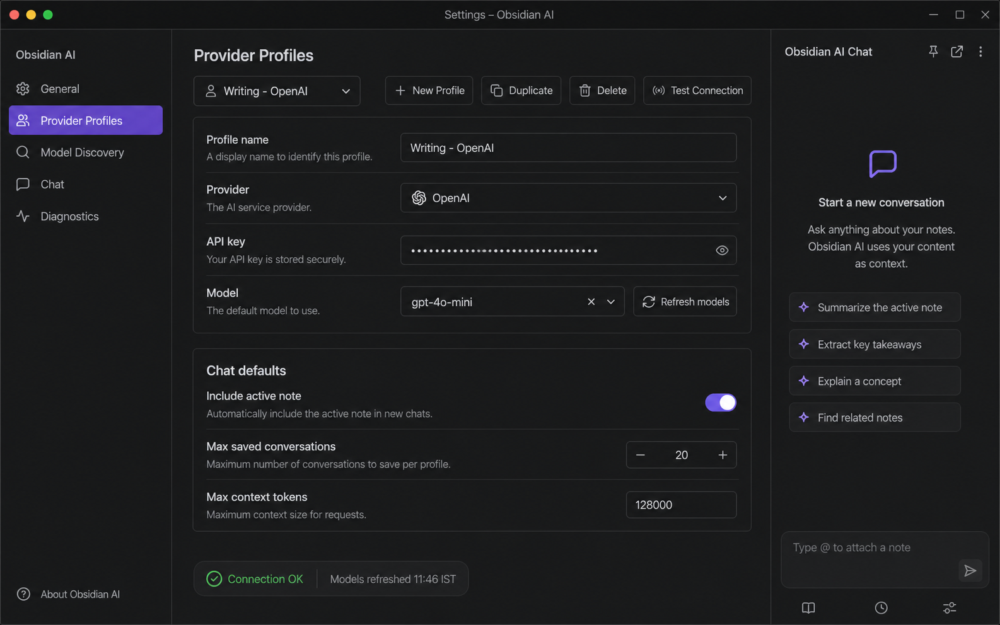

# Settings & Provider Profile Design
*Created: 2026-05-02 11:46:39 IST*
*Last Updated: 2026-09-02 18:06:05 IST*

## Overview

The current settings screen is a single global configuration: one provider, one model, and one API key. The provider-profile design lets users keep multiple inference configurations and switch between them without rewriting credentials.

T70 clarification: `ProviderProfile.model` is the profile default. The
effective model shown and used by an active chat may be session-specific, with
an explicit session override taking precedence over legacy message metadata
and the profile default. See `T70-active-chat-model-identity.md`.

T70 also defines `recentModels` as provider-scoped history: all credential
profiles for one provider share the same ten-entry list. `ProviderProfile`
model caches remain profile-scoped because different credentials may expose
different catalogues. Legacy profile-keyed recent histories are normalized
into provider keys during settings load and import/sync merges.

## Generated UI Reference

The generated UI/UX reference has been saved in the memory bank:



Use this as the visual direction for the fuller settings experience: compact Obsidian-style settings navigation, profile controls, model refresh controls, chat defaults, and a diagnostics-oriented layout. The first implementation slice uses native Obsidian `Setting` rows rather than a custom React settings view.

## Current Limitation

```text
ObsidianAISettings
  provider: "openai" | "ollama" | "custom" | "gemini" | "azure"
  model: string
  apiKey?: string
  customURL?: string
  azureEndpoint?: string
  azureApiVersion?: string
```

Problems:

- Only one API key can be stored
- Provider-specific fields share one flat namespace
- Switching providers can leave stale model/API key combinations
- There is no connection validation before chat requests
- Chat, inline editing, and future features all depend on the same fragile tuple

## Target Settings Schema

```typescript
type ProviderType = "openai" | "ollama" | "custom" | "gemini" | "azure";

interface ProviderProfile {
  id: string;
  name: string;
  provider: ProviderType;
  model: string;
  apiKey?: string;
  customURL?: string;
  azureEndpoint?: string;
  azureApiVersion?: string;
  modelCache?: ModelCache;
  createdAt: number;
  updatedAt: number;
}

interface ObsidianAISettings {
  providerProfiles: ProviderProfile[];
  activeProviderProfileId: string;

  selectionPrompt: string;
  cursorPrompt: string;
  customCommands: SlashCommand[];
  commandPrefix: string;
  messageHistory: boolean;

  includeActiveNote: boolean;
  maxContextTokens: number;
  maxSavedConversations: number;
  debugLogLevel: "off" | "error" | "info" | "debug";
  debugLogRetention: number;
}
```

## Migration Flow

```text
loadSettings()
  |
  v
Does data.providerProfiles exist?
  |
  +-- yes --> merge with defaults
  |
  +-- no --> build first profile from legacy fields
             provider/model/apiKey/customURL/azureEndpoint/azureApiVersion
             |
             v
             activeProviderProfileId = generated profile id
```

## Settings UI

```text
+--------------------------------------------------+
| Provider Profiles                                |
|--------------------------------------------------|
| Active profile                                   |
| [Writing - OpenAI                         v]     |
| [New profile] [Duplicate] [Delete] [Test]        |
|                                                  |
| Name                                             |
| [Writing - OpenAI_________________________]      |
|                                                  |
| Provider                                         |
| [OpenAI                                  v]      |
|                                                  |
| API key                                          |
| [sk-************************************] [eye]  |
|                                                  |
| Model                                            |
| [gpt-4o-mini                            v]       |
|                                                  |
| Provider-specific fields                         |
|   Custom base URL      [https://..._______]      |
|   Azure endpoint       [https://..._______]      |
|   Azure API version    [2024-02-15-preview]      |
+--------------------------------------------------+
```

## Code Structure

```text
src/
  settings.ts
    ObsidianAISettings
    ProviderProfile
    DEFAULT_SETTINGS
    normalizeSettings()
    getActiveProviderProfile()
    ObsidianAISettingsTab

  api.ts
    ChatApiManager
      updateSettings(settings)
      initializeChatClient(activeProfile)
```

The first T9 implementation keeps provider-profile helpers in `settings.ts` to avoid adding a premature module boundary. A future refactor can extract them to `src/providers/providerProfile.ts` when model discovery and diagnostics expand the provider layer.

## Provider Resolution

```text
ChatApp / FloatingWidget
        |
        v
ChatApiManager.callApi() / callSelection() / streamChat()
        |
        v
getActiveProfile(settings)
        |
        v
initializeChatClient(profile)
        |
        +--> OpenAI profile
        +--> Ollama profile
        +--> Gemini profile
        +--> Azure OpenAI profile
        +--> Custom OpenAI-compatible profile
```

## Validation

The "Test connection" button should:

1. Validate required local fields
2. Initialize the provider client
3. Prefer a lightweight model-list or metadata request when available
4. Fall back to a tiny completion request only if needed
5. Report success/failure through `Notice` and debug logs

## Privacy Rules

- API keys are stored in plugin data like current settings
- API keys are never shown in debug logs
- Reveal/hide is local UI state only
- Exported logs redact endpoint query strings and credentials

## Open Questions

- Whether to support per-feature active profiles later, such as separate inline/chat profiles
- Whether to move API keys to a different storage strategy if Obsidian exposes a better secure-storage option

## Implementation Status

Completed on 2026-05-02 12:09:43 IST:

- Provider-profile settings schema
- Legacy flat-settings migration
- Active profile selector, create, duplicate, delete, rename, and test controls
- Provider-specific API key/custom/Azure fields
- Chat defaults for include-active-note, max saved conversations, and max context tokens
- `ChatApiManager` active-profile resolution
- `pnpm run build` verification

Enhanced on 2026-05-02 16:55:00 IST:

- Added universal endpoint field for all 9 providers with `getDefaultEndpoint()` fallback (not just custom/azure)

Refreshed on 2026-05-12 11:13:59 IST:

- Replaced the corrupted Settings panel with a cleaner sectioned layout in `src/settings.ts`
- Added a hero/header treatment and matching `styles.css` styling for the settings experience
- Restored guarded `display()` refresh behavior to avoid re-entrant loops while changing profiles
- Restored the cached-model fetch/search picker behavior for provider profiles
- Replaced the warning-style hero copy with a proper header after visual review

### Web Search Settings (T18, 2026-05-16)

Added web search provider configuration to Settings panel:

```typescript
type WebSearchProvider = "brave" | "duckduckgo" | "tavily" | "exa" | "searxng";

interface ObsidianAISettings {
  // ... existing fields ...
  webSearchProvider: WebSearchProvider;  // default: "duckduckgo"
  braveApiKey: string;
  tavilyApiKey: string;
  exaApiKey: string;
  searxngUrl: string;
}
```

**UI Section:** `renderWebSearch(containerEl)`
- Provider dropdown with 5 options, each labeled with cost/requirements:
  - DuckDuckGo — free, no API key
  - Brave Search — 2000 queries/month free, requires API key
  - Tavily — AI search, free tier, requires API key
  - Exa — neural search, free tier, requires API key
  - SearXNG — self-hosted, no API key
- Conditional API key fields (password input) for Brave, Tavily, Exa
- Conditional URL field for SearXNG
- Added between "Agent Tools" and "Advanced" sections

### Profile Dropdown Behavior (T16, 2026-05-17)

The participant dropdown in ChatApp doubles as a profile switcher in 1:1 mode:

**1:1 Mode (single participant):**
- Dropdown shows radio buttons (single selection)
- Clicking a different profile:
  1. Updates `activeProviderProfileId` in settings
  2. Increments `settingsTick` to force `resolvedProfile` re-computation
  3. Saves settings to disk
  4. Next message uses the new profile

**Council Mode (2+ participants):**
- Dropdown shows checkboxes (multi-selection)
- Adding/removing participants updates council composition
- Does NOT change `activeProviderProfileId`

**Badge behavior:**
- Always shows at least 1 (fixed from showing 0 in 1:1 mode)
- Council mode: shows participant count

**Implementation note:** The `settingsTick` increment pattern is used to force React to re-compute `resolvedProfile` useMemo when the active profile changes outside the normal settings panel flow.

## 2026-05-12 Regression and Rewrite

The original T9 Settings panel included `isDisplaying`/`pendingRefresh` guards to prevent re-entrant `display()` calls. These protections were lost in a later edit, causing the panel to become corrupted. The symptoms were:

1. **Re-entrant / infinite loops**: `saveSettings(true)` called `display()` while `display()` was already running, which triggered further setting changes and more `display()` calls.
2. **Memory leaks**: Each nested `display()` call recreated DOM nodes and closures while the previous render was still active, leaving orphaned references.

GPT 5.4 Medium performed a clean rewrite of `src/settings.ts` (commit `4fa9e63`) that restored the guard mechanism and restructured the panel into a cleaner sectioned layout.

### Guard Mechanism

```typescript
private isDisplaying = false;
private pendingRefresh = false;

private async saveSettings(options?: { refresh?: boolean; quiet?: boolean }) {
    const refresh = options?.refresh ?? false;
    await this.plugin.saveSettings();
    this.plugin.chatapi.updateSettings(this.plugin.settings);
    if (refresh) {
        if (this.isDisplaying) {
            this.pendingRefresh = true;
            return;
        }
        this.display();
    }
}

display(): void {
    this.isDisplaying = true;
    try {
        const { containerEl } = this;
        containerEl.empty();
        // ... render sections ...
    } finally {
        this.isDisplaying = false;
        if (this.pendingRefresh) {
            this.pendingRefresh = false;
            this.display();
        }
    }
}
```
