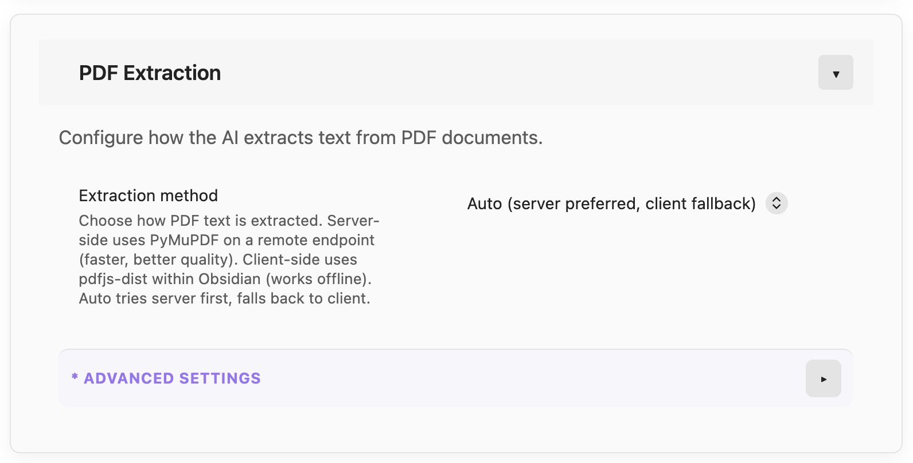
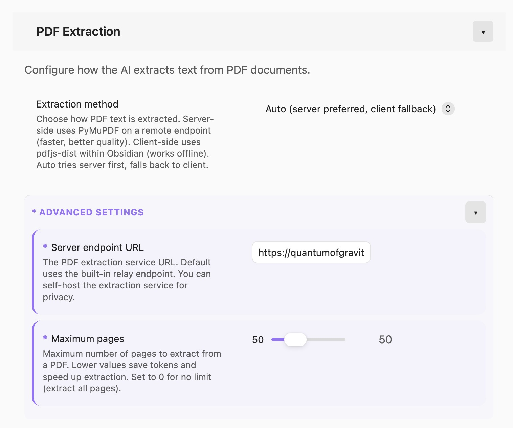

# 2026-09-09 — Settings and Chat Export Follow-up

## Focus Task

T34: Settings Panel UI/UX Improvements

**Status**: ✅ SESSION COMPLETE

## Objective

Record the complete Settings and chat-export work discussed during the session,
including the long-context/token-usage analysis, the Settings redesign, the
unified serializer, and the final user-confirmed visual state.

## Work Completed

### Context and architecture discussion

- Reviewed the attached Obsidian-ai chat export concerning tool-call results,
  message context, context propagation, and approximately 600k tokens of use.
- Discussed bounded model history, transcript fidelity, tool-result replay,
  asynchronous running summaries, local/deterministic alternatives, and the
  need to keep the persisted transcript separate from model-facing context.
- The existing T48/T48a–T48d task family remains the owner of compaction,
  running summaries, replay, and usage reconciliation. This session did not
  change those implementation paths.

### Settings and export implementation

- Added a prominent settings search field with matching across names,
  descriptions, and sections.
- Added a persisted overall Show advanced settings toggle and the local Debug
  Mode section with selectable provider usage, request estimate, tool detail,
  context metadata, and model timing export fields.
- Added a visible Debug mode indicator in the chat UI.
- Added the canonical `serializeChatExport()` entry point and routed message
  selection, session copy, and session export through it for Markdown, JSON,
  and JSONL.
- Audited every Settings section and distributed advanced controls by domain.
  Removed the obsolete standalone Advanced section; kept Sync Components
  normal; placed Developer mode under Agent Tools; placed Clear all chat
  history under Backup & Restore.
- Added independently persisted, collapsible Advanced settings groups at the
  end of mixed sections. Existing asterisk markers were retained. Search opens
  the relevant group, and Expand/Collapse All includes both section and nested
  group state.
- Compacted the Settings hero and corrected the responsive settings grid,
  including the PDF Extraction description/control layout.

## Visual Acceptance

The user confirmed that the final presentation looks and feels substantially
better. The supplied screenshots show the same PDF Extraction section with the
Advanced group collapsed and expanded:

## Records Updated

- `memory-bank/tasks/T34.md`
- `memory-bank/tasks/T20.md`
- `memory-bank/tasks/T61.md`
- `memory-bank/implementation-details/settings-panel-and-startup-followup.md`
- `memory-bank/activeContext.md`
- `memory-bank/progress.md`
- `memory-bank/session_cache.md`
- `memory-bank/changelog.md`

No new task or subtask was created. T49 remains the settings backup/import
task, T51 remains the disabled network-telemetry task, and T48's summary and
context subtasks remain open for their previously documented acceptance work.

## Source and Verification

- Pushed commits: `fd6191e`, `e39e6e4`, `1da6d14`, `a0df1c9`, `f9c129d`,
  `f3b6123`, and final `5e978af`.
- 53 test files passed / 454 tests passed.
- TypeScript and production build passed.
- `git diff --check` passed.
- Local `main` and `origin/main` match at `5e978af`.

## Deferred Proposals

The proposed Minimum / Normal / Enhanced metadata preset for ordinary export
and copy actions was discussed but not implemented. Additional running-summary
changes were also not made here; the existing compaction architecture and its
open acceptance items remain recorded under T48c.
